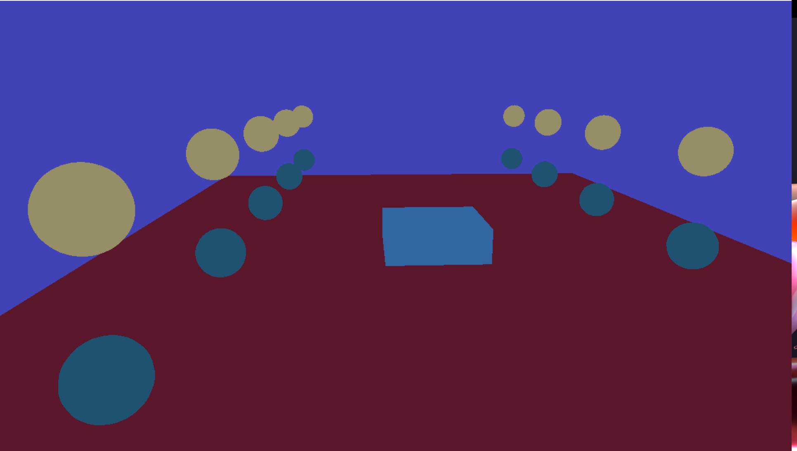
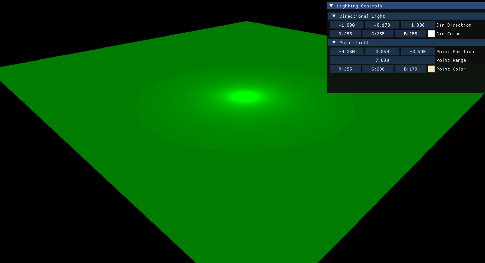

# DirectX 12 Practice Engine

A compact extendable DirectX 12 playground built for learning modern GPU programming.  
This is **not** a exact replica of Frank Luna's DX12 textbook, instead it's a custom architecture built so I can freely add features, experiment, and practice computer graphics.

## Outputs

## About the Project
- Powered by **DirectX 12**
- Used for practicing:
  - GPU pipelines & command queues
  - Root signatures & descriptor heaps
  - Lighting
  - Geometry generation & materials
  - Real-time rendering experiments
  - still coding more....